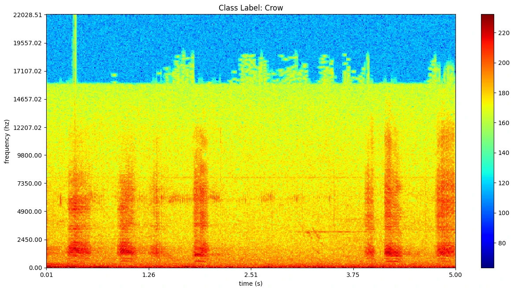
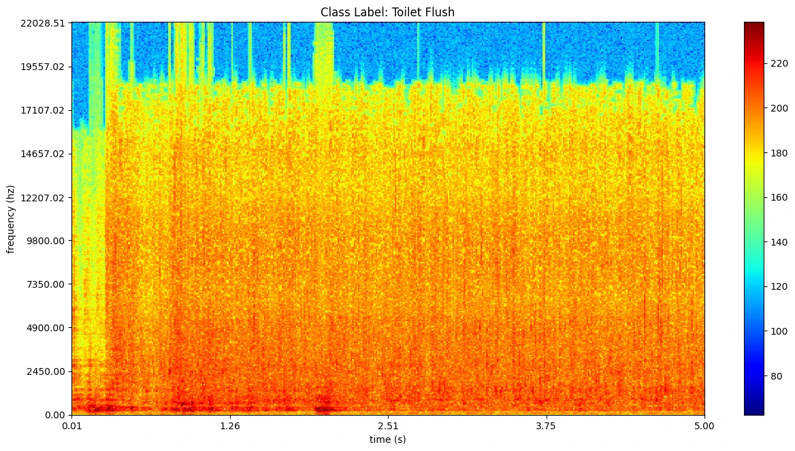
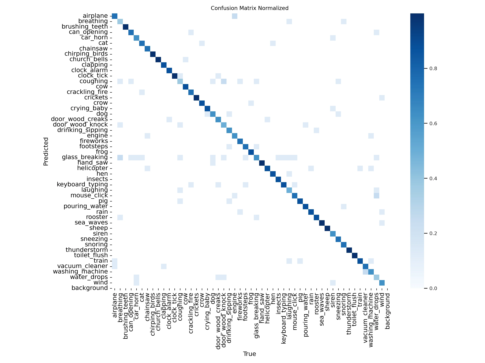

 
# Audio Classification with Computer Vision

Use an PyTorch image classifier to predict audio file labels for the following dataset.

## Dataset

> The [ESC-50 dataset](https://github.com/karolpiczak/ESC-50) is a labeled collection of 2000 environmental audio recordings suitable for benchmarking methods of environmental sound classification.
>
> The dataset consists of 5-second-long recordings organized into 50 semantical classes (with 40 examples per class) loosely arranged into the following categories:

| class | instances |
| -- | -- |
| dog | 40 |
| glass_breaking | 40 |
| drinking_sipping | 40 |
| rain | 40 |
| insects | 40 |
| laughing | 40 |
| hen | 40 |
| engine | 40 |
| breathing | 40 |
| crying_baby | 40 |
| hand_saw | 40 |
| coughing | 40 |
| snoring | 40 |
| chirping_birds | 40 |
| toilet_flush | 40 |
| pig | 40 |
| washing_machine | 40 |
| clock_tick | 40 |
| sneezing | 40 |
| rooster | 40 |
| sea_waves | 40 |
| siren | 40 |
| cat | 40 |
| door_wood_creaks | 40 |
| helicopter | 40 |
| crackling_fire | 40 |
| car_horn | 40 |
| brushing_teeth | 40 |
| vacuum_cleaner | 40 |
| thunderstorm | 40 |
| door_wood_knock | 40 |
| can_opening | 40 |
| crow | 40 |
| clapping | 40 |
| fireworks | 40 |
| chainsaw | 40 |
| airplane | 40 |
| mouse_click | 40 |
| pouring_water | 40 |
| train | 40 |
| sheep | 40 |
| water_drops | 40 |
| church_bells | 40 |
| clock_alarm | 40 |
| keyboard_typing | 40 |
| wind | 40 |
| footsteps | 40 |
| frog | 40 |
| cow | 40 |
| crickets | 40 |


## Data Preprocessing

Download the dataset all `*.wav` files to `dataset/ESC-50/audio` and run the pre-processing scripts to generate the corresponding spectrograms. The __Train/Val-Split__ will then copy all image files to `./data`:

```bash
├── data
│   ├── test
│   ├── train
│   ├── val
├── dataset
│   └── ESC-50
│       ├── audio
│       └── spectrogram
```

### Spectrograms







## Model Training

Run the YOLO model inside the a PyTorch container image with [Jupyter Notebooks](https://github.com/mpolinowski/pytorch-jupyter):


```bash
docker run --ipc=host --gpus all -ti --rm \
    -v $(pwd):/opt/app -p 8888:8888 \
    --name pytorch-jupyter \
    pytorch-jupyter:latest
```





